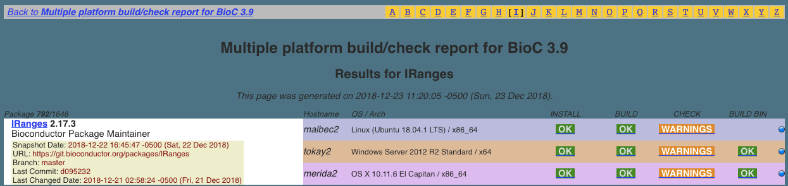
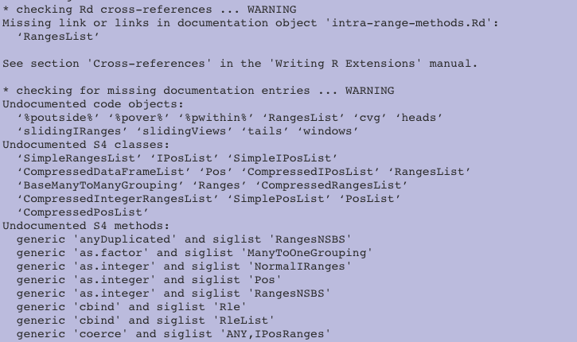

# Introduction

Bioconductor is an open-source, open-development R-based software and data ecosystem for the analysis and comprehension of genome-scale assays.  This document briefly describes technical concepts underlying the current system.

Three main lobes of Bioconductor are

   - the IT infrastructure for source-code control, continuous integration, multiplatform deployment, release synchronization and archiving, construction of containers and VM images, markdown processing
   - the domain-specific infrastructure that defines key user-facing classes and methods, such as Biostrings, SummarizedExperiment and GRanges, OrgDb/EnsDb SQLite-based annotation database schemas and interfaces, and the AnnotationHub/ExperimentHub resource discovery and caching methods
   - the user-facing/developer-facing package ecosystem and support facilities

Current, lightly coordinated development efforts include

   - lazy computation with out-of-memory array-like resources using DelayedArray
   - efficient environment-adaptive computation of matrix decompositions
   - general attack on massive single-cell assays
   - API-driven resolution of queries on annotation (SRAdbV2 at github.com/seandavi) and matrix content (rhdf5client, restfulSE)

Larger infrastructure-oriented requirements will likely emerge through involvements with

   - NHGRI AnVIL
   - Human Cell Atlas

# IT infrastructure

Since its inception, Bioconductor has evolved in concert
with the R language, which itself has a bifurcated release
process.  

- In R, the 'R-devel' branch incorporates new features
and code that may break aspects of the language.
The 'R-patched' branch evolves to fix bugs in the current
release of R, and no new features may be introduced.

- In Bioconductor, the same distinction is present,
but the branches are called bioc-devel, and bioc-release,
respectively.  Furthermore, the bioc-devel branch transitions
to bioc-release every six months.  When these transitions
occur, the version of R (patched vs. devel) that is used for developing
code also changes.  Details on synchronization
are provided at the [developers advice page](https://bioconductor.org/developers/how-to/useDevel/).

<!--
Package authors should develop against the version of R that will be available to users when the Bioconductor devel branch becomes the Bioconductor release branch.

R has a ‘.y’ release in x.y.z every year (typically mid-April), but Bioconductor has a .y release (where current devel becomes release) every 6 months (mid-April and mid-October).

This means that, from mid-October through mid-April, Bioconductor developers should be developing against R-devel. From mid-April to mid-October, developers should use R-release (actually, the R snapshot from the R-x-y-branch) for Bioconductor development.

See the BiocManager vignette for instructions on using multiple versions of Bioconductor.
-->

## Build system for continuous integration

For a top-down approach to understanding the build system,
let's look at the landing page for the IRanges package.

All Bioconductor packages are accompanied by HTML pages
in this format.

- Badges describe the package portability (platform), 
frequency of download (rank), public
discussion frequency (posts), longevity, current
build state (ok/warnings/error), and maintenance
activity (updated).  These badges are updated daily.
- A DOI is computed for each package, referring to the
'release' version.
The landing page includes a collection of badges that report
high-level metadata about the package.
- The 'build' badge links to the build system reporting
page; on clicking 'warnings', we have

The actual warnings (which may be platform-dependent) are also
hyperlinked.

